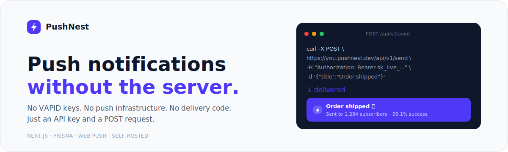
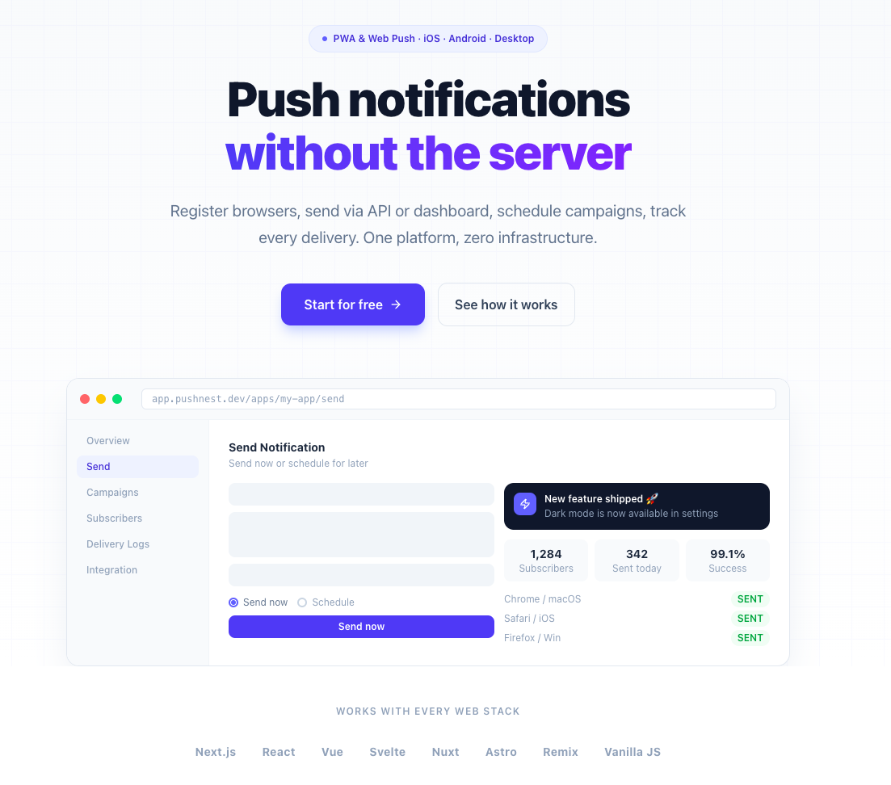
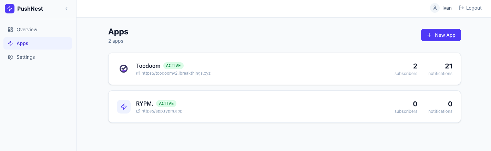
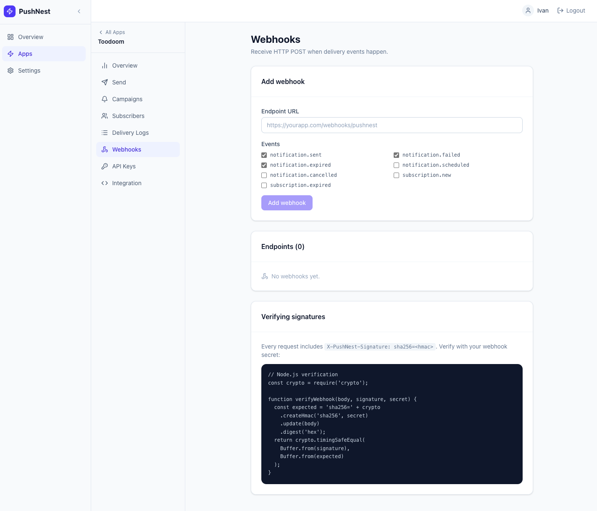

<p align="center">
  
</p>

<p align="center">
  <a href="https://github.com/ivucicev/PushNest/actions"></a>
  <a href="https://ghcr.io/ivucicev/pushnest"></a>
  <a href="LICENSE"></a>
</p>

<p align="center">
  <b>Live demo:</b> <a href="https://pushnest.ibreakthings.xyz">pushnest.ibreakthings.xyz</a> — login with <code>demo@demo.com</code> / <code>Demo123!</code> or <a href="https://pushnest.ibreakthings.xyz/register">create a free account</a>.
</p>

---

```bash
curl -X POST https://your-pushnest.com/api/v1/send \
  -H "Authorization: Bearer YOUR_API_KEY" \
  -d '{ "title": "Order shipped 📦", "body": "Your order is on its way!" }'
```

That's it. Every subscribed browser gets the notification — no push server to run.

---



## Why PushNest

Most teams skip web push because the setup is painful — VAPID keys, push endpoints, payload encryption, 410 handling, retry logic. PushNest does all of it so you don't have to.

| Without PushNest | With PushNest |
|-----------------|---------------|
| Generate & store VAPID keys | Auto-generated per app |
| Build subscribe/unsubscribe endpoints | Single hosted endpoint |
| Manage push endpoints per user | We store and fan out |
| Handle 410 expired subscriptions | Auto-cleaned |
| Write retry logic | Built-in retry |
| Debug delivery failures | Per-delivery logs + status codes |
| Schedule notifications | `scheduledAt` param |

Self-host it. Own your data. Zero vendor lock-in.

---

## Features

- **REST API** — one endpoint to send, one to subscribe. Works from any backend or cURL.
- **Dashboard** — send campaigns, view delivery logs, manage subscribers — no code needed.
- **Scheduling** — pass `scheduledAt` to fire at a specific UTC time. Cancel any time before delivery.
- **Audience targeting** — broadcast to all, or send to specific users by `externalUserId`.
- **Click tracking** — know exactly who clicked and when. CTR per notification.
- **Webhooks** — get POSTed on `sent`, `failed`, `clicked`, `expired`. HMAC-signed.
- **Retry failed** — re-queue failed deliveries with one click or one API call.
- **Multi-app** — one account, unlimited apps, each with isolated VAPID keys and API keys.
- **Auto-expire** — dead subscriptions (404/410) cleaned automatically. No stale data.
- **Cross-platform** — Chrome, Firefox, Edge, Safari 16+, iOS PWA, Android, macOS, Windows.

---



## Get started in 5 minutes

### 1. Deploy (one command)

```bash
docker run -d \
  -p 3000:3000 \
  -e DATABASE_URL="file:./data/pushnest.db" \
  -e NEXT_PUBLIC_APP_URL="https://push.yourcompany.com" \
  -v $(pwd)/data:/app/data \
  ghcr.io/ivucicev/pushnest:main
```

### 2. Create an account

Open `https://push.yourcompany.com`, register, and create your first app. Your VAPID keys and API key are generated instantly.

### 3. Add two snippets to your frontend

**`/push-sw.js`** — copy from [public/push-sw.js](public/push-sw.js) to your web root.

**Subscribe users:**

```js
async function enableNotifications() {
  const reg = await navigator.serviceWorker.register('/push-sw.js');
  const permission = await Notification.requestPermission();
  if (permission !== 'granted') return;

  const sub = await reg.pushManager.subscribe({
    userVisibleOnly: true,
    applicationServerKey: 'YOUR_VAPID_PUBLIC_KEY',  // Dashboard → Integration
  });

  const { endpoint, keys } = sub.toJSON();
  await fetch('https://push.yourcompany.com/api/v1/apps/APP_ID/subscribe', {
    method: 'POST',
    headers: { 'Content-Type': 'application/json' },
    body: JSON.stringify({
      endpoint,
      p256dh: keys.p256dh,
      auth: keys.auth,
      externalUserId: currentUser.id,  // optional, for targeting
    }),
  });
}
```

### 4. Send from your backend

```js
// Node.js
await fetch('https://push.yourcompany.com/api/v1/send', {
  method: 'POST',
  headers: {
    'Authorization': 'Bearer YOUR_API_KEY',
    'Content-Type': 'application/json',
  },
  body: JSON.stringify({
    title: 'Your order shipped 📦',
    body: 'Estimated delivery: tomorrow',
    url: 'https://yourapp.com/orders/123',
    audience: { externalUserIds: ['user_456'] },
  }),
});
```

**Schedule for later:**

```js
body: JSON.stringify({
  title: 'Weekly digest',
  scheduledAt: '2025-02-01T09:00:00Z',
})
```

**Broadcast to everyone:**

```js
body: JSON.stringify({
  title: 'New feature just dropped 🚀',
  body: 'Dark mode is here.',
})
// audience omitted = sends to all active subscribers
```

---

## API reference

### Send a notification

```
POST /api/v1/send
Authorization: Bearer YOUR_API_KEY
```

| Field | Type | Description |
|-------|------|-------------|
| `title` | string | Notification title (required) |
| `body` | string | Notification body |
| `url` | string | URL to open on click |
| `icon` | string | Icon URL |
| `tag` | string | Replaces existing notification with same tag |
| `scheduledAt` | ISO 8601 | Schedule for later (UTC) |
| `audience.all` | boolean | Send to all subscribers (default) |
| `audience.externalUserIds` | string[] | Target specific users |
| `audience.subscriptionIds` | string[] | Target specific subscriptions |

**Response:**
```json
{ "ok": true, "notificationId": "clx...", "queued": 1284, "scheduled": false }
```

### Other endpoints

| Method | Path | Auth | Description |
|--------|------|------|-------------|
| `POST` | `/api/v1/apps/:id/subscribe` | none | Register browser |
| `DELETE` | `/api/v1/apps/:id/unsubscribe` | none | Unsubscribe browser |
| `POST` | `/api/v1/apps/:id/notifications/:id/cancel` | API key | Cancel scheduled |
| `POST` | `/api/v1/apps/:id/notifications/:id/retry` | API key | Retry failed |
| `POST` | `/api/v1/track/click` | none | Track click |
| `GET/POST` | `/api/v1/apps/:id/webhooks` | session | Manage webhooks |

---

## Webhooks



Get notified on every delivery event. PushNest signs every request with HMAC-SHA256.

**Events:** `notification.sent` · `notification.failed` · `notification.expired` · `notification.scheduled` · `notification.cancelled` · `subscription.new` · `subscription.expired`

**Verify the signature:**

```js
const crypto = require('crypto');

function verifyWebhook(rawBody, signature, secret) {
  const expected = crypto
    .createHmac('sha256', secret)
    .update(rawBody)
    .digest('hex');
  return expected === signature;
}

// In your handler:
const sig = req.headers['x-pushnest-signature'];
if (!verifyWebhook(req.rawBody, sig, process.env.PUSHNEST_WEBHOOK_SECRET)) {
  return res.status(401).end();
}
```

---

## Self-hosting

### docker-compose (recommended)

```yaml
version: "3.9"
services:
  web:
    image: ghcr.io/ivucicev/pushnest:main
    ports: ["3000:3000"]
    environment:
      DATABASE_URL: file:./data/pushnest.db
      NEXT_PUBLIC_APP_URL: https://push.yourcompany.com
    volumes: ["./data:/app/data"]
    restart: unless-stopped

  worker:
    image: ghcr.io/ivucicev/pushnest:main
    command: node src/worker/index.js
    environment:
      DATABASE_URL: file:./data/pushnest.db
    volumes: ["./data:/app/data"]
    depends_on: [web]
    restart: unless-stopped
```

The **worker** is a separate process that handles async delivery and scheduled notifications. Run it alongside the web app — it polls every 5 seconds.

### From source

```bash
git clone https://github.com/ivucicev/PushNest.git
cd PushNest
npm install
cp .env.example .env
npx prisma migrate deploy
npm run dev      # web app on :3000
npm run worker   # delivery worker (separate terminal)
```

---

## Stack

Built on boring, proven technology. No moving parts.

- **[Next.js 16](https://nextjs.org)** — app router, API routes, proxy
- **[Prisma 7](https://prisma.io) + SQLite** — zero-dependency database, file-based, easy backups
- **[web-push](https://github.com/web-push-libs/web-push)** — VAPID key signing and push delivery
- **[jose](https://github.com/panva/jose)** — Edge-compatible JWT for auth

No Redis. No external queue. No managed services required.

---

## License

MIT — use it, fork it, ship it.
